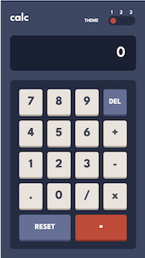
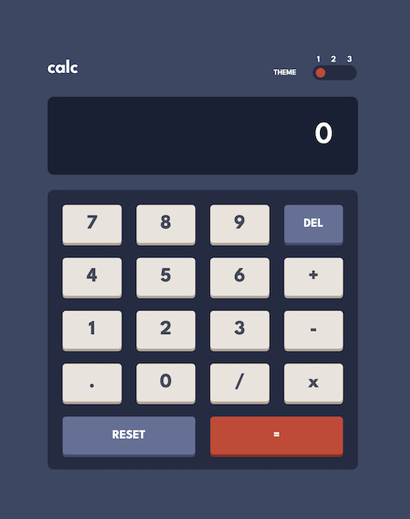

# Frontend Mentor - Calculator app solution

This is a solution to the [Calculator app challenge on Frontend Mentor](https://www.frontendmentor.io/challenges/calculator-app-9lteq5N29). Frontend Mentor challenges help you improve your coding skills by building realistic projects.

## Table of contents

- [Overview](#overview)
  - [The challenge](#the-challenge)
  - [Screenshot](#screenshot)
  - [Links](#links)
- [My process](#my-process)
  - [Built with](#built-with)
- [Author](#author)

## Overview

### The challenge

Users should be able to:

- See the size of the elements adjust based on their device's screen size
- Perform mathmatical operations like addition, subtraction, multiplication, and division
- Adjust the color theme based on their preference
- **Bonus**: Have their initial theme preference checked using `prefers-color-scheme` and have any additional changes saved in the browser

### Screenshot

### Links

- Solution URL: [Add solution URL here](https://your-solution-url.com)
- Live Site URL: [https://jacob-briscoe.github.io/calculator/](https://jacob-briscoe.github.io/calculator/)

## My process

### Built with

- Mobile-first workflow
- React
- Styled Components
- TypeScript
- [React](https://reactjs.org/) - JS library
- [Styled Components](https://styled-components.com/) - For styles
- [TypeScript](https://www.typescriptlang.org/) - Language
- [Vite](https://vitejs.dev/) - For builds

## Author

- Website - [Jacob Briscoe](https://github.com/jacob-briscoe)
- Frontend Mentor - [@jacob-briscoe](https://www.frontendmentor.io/profile/jacob-briscoe)
